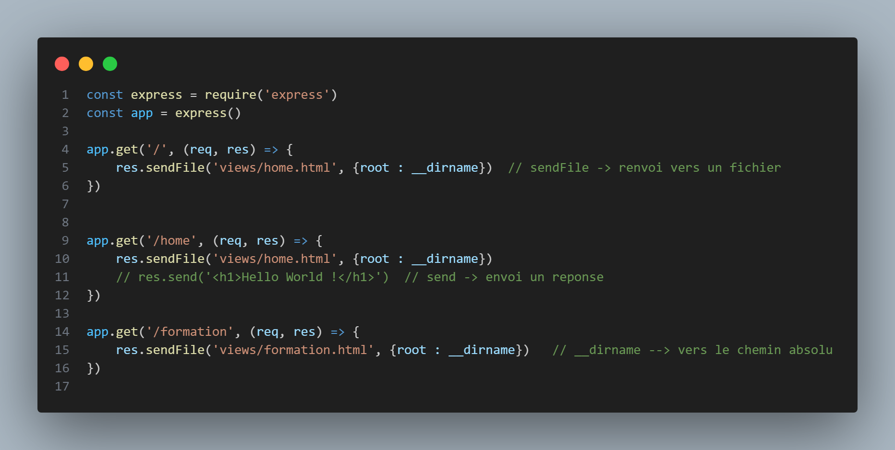
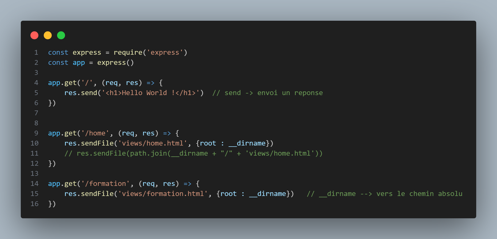
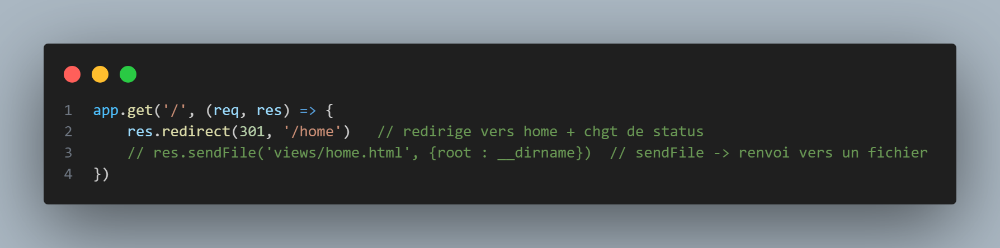
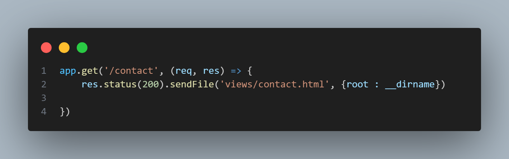
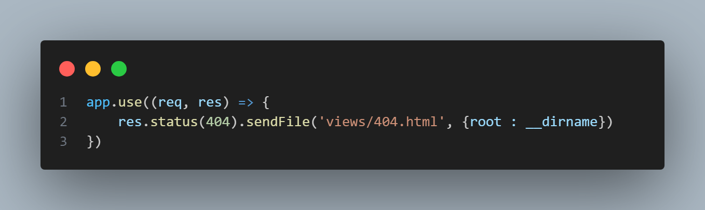
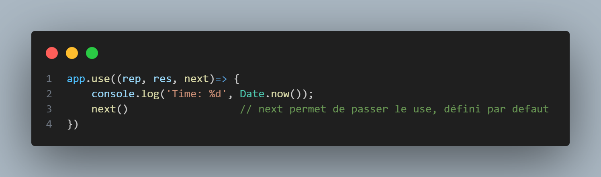
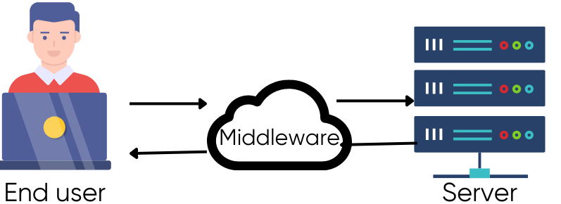

# Codes d'état HTTP

Afficher / masquer la sous-section Codes d'état
1xx - Information
2xx - Succès
3xx - Redirection
4xx - Erreur du client HTTP
5xx - Erreur du serveur / du serveur d'application

## Installation EXPRESS

PS C:\Workspaces\coursNodeJs> npm install express

const express = require('express')
const app = express()

app.get('/', (req, res) => {
    res.sendFile('views/home.html', {root : __dirname})  // sendFile -> renvoi vers un fichier
})

app.get('/home', (req, res) => {
    res.sendFile('views/home.html', {root : __dirname})   
    // res.send('<h1>Hello World !</h1>')  // send -> envoi un reponse
})

app.get('/formation', (req, res) => {
    res.sendFile('views/formation.html', {root : __dirname})   // __dirname --> vers le chemin absolu
})

#### Changement de status : 200 -> succès de la requête.

#### Page inexistante : redirection vers page 404

app.use((req, res) => {
    res.status(404).sendFile('views/404.html', {root : __dirname})   
})

#### next pour passer au cas suivant :
il execute en meme tps qu'il passe à la suite

## Middleware 
Entre le client et le serveur

