# coursNodeJS

# 03 - IntroExpress

PS C:\Workspaces\coursNodeJs\03-IntroExpress> npm install ejs

## Définition du moteur de template
app.set('view engine', 'ejs')

La méthode sendFile est remplacée par render

### Définition des views (si elles ne sont pas dans un dossier views, mais toto)

app.set('views', 'toto');

### Fichiers .html --> .ejs

==> Pour éxécuter des fichiers dans le front, il faut renommer les fichiers html en .ejs.

## Définition de la variable title - balise Scriptlet

==> Décalaration de la variable title :

<% let title = 'Portfolio de Jérôme' %>  

==> Affichage de la variable title avec : <%=

ex:  <'h1 class="mb-1">**<%= title %>**<'/h1>

## Définition de Props (variable transmise d'un fichier à un autre)

**render** (remplace sendFile): renvoi les variables dans chaque page

ex : Title qui voyage d'un endroit à un autre : de app.js vers home.ejs

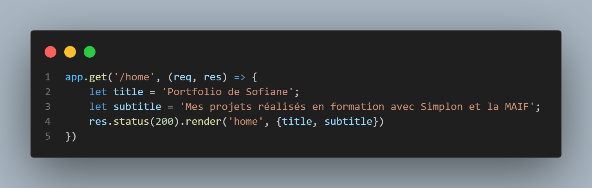

renvoi les emplacements des variables par les valeurs définis pour chaque page.

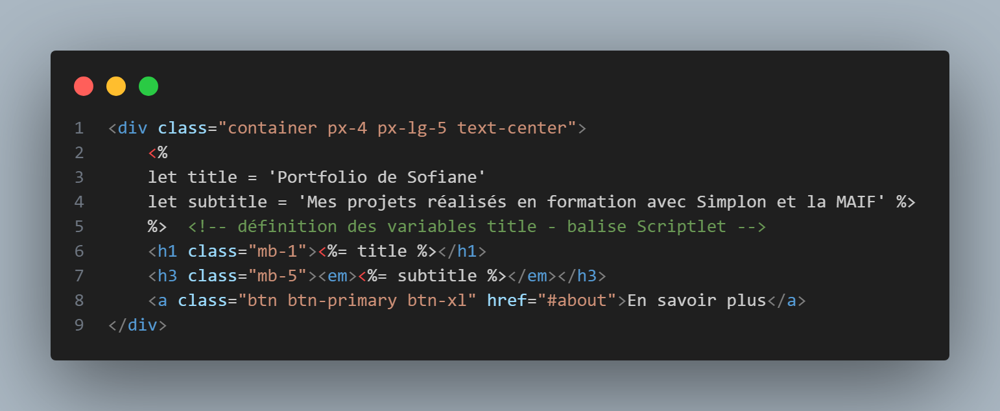

## Déclaration de composants : "components"
## Injection du header

Création d'un dossier **components/header.ejs** dans /views

Copier l'ensemble du header des autres pages

Coller le lien :  **<**%- include('components/header'); %>**
dans chacune des pages.

puis définition des titres et sous-titres pourchaque page dans app.ejs

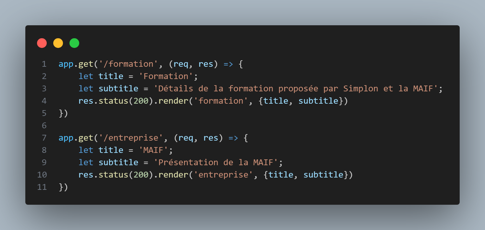

## Définition de la page active.

Dans app.js avec définition de la variable : currentPage
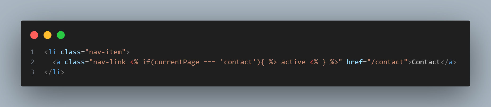

Dans Header.ejs

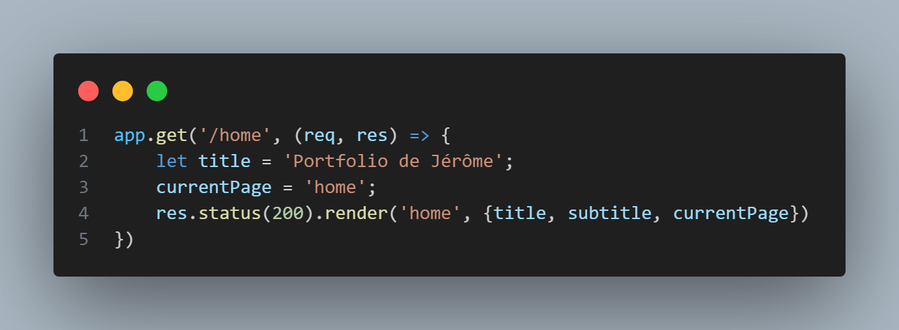

## Utilisation Props projects pour injecter les 4 cartes sur la page home

Création du fichier cardProject dans /components
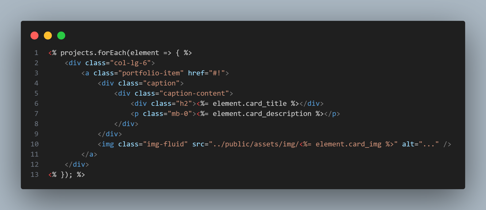

Suppression et injection des cartes via le fichier /components/cardProject
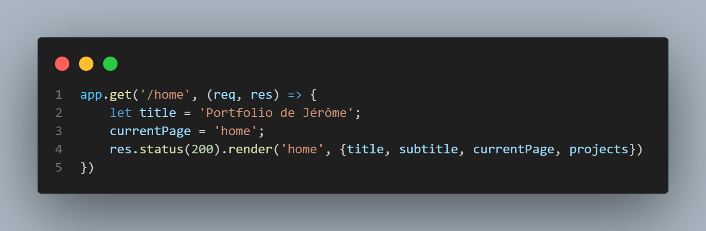

Définition du tableau d'objets projets (pour définir les cartes)
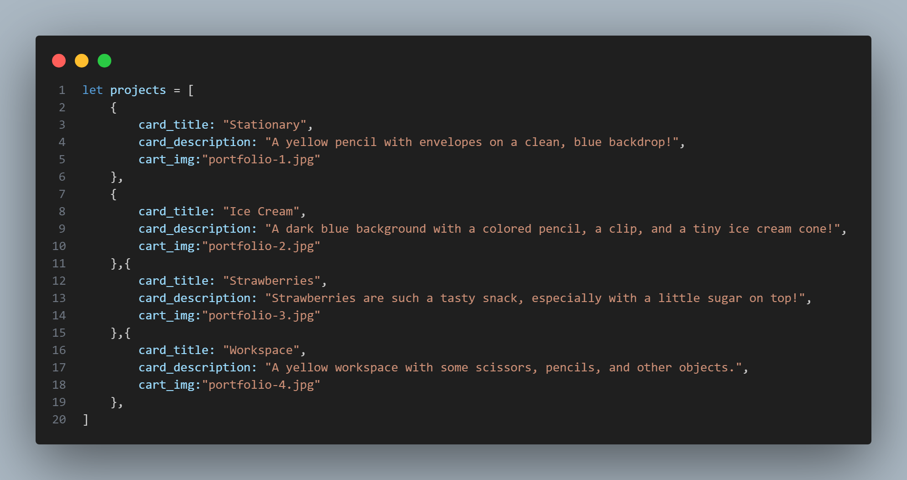

## Nouveau fichier data.js avec subtitle et projects

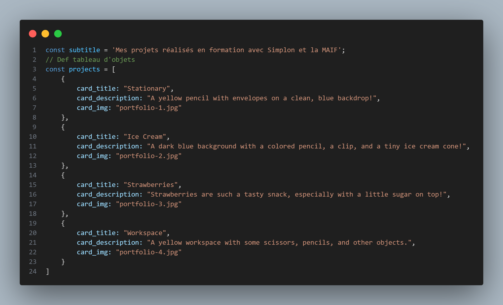

Export du fichier data :
module.exports = { subtitle, projects }
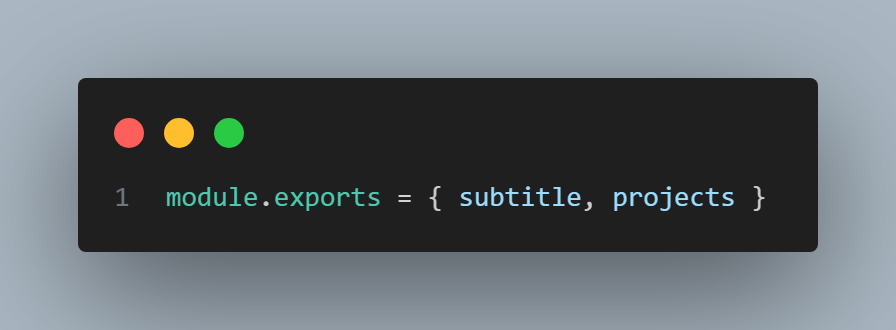

Import dans le fichier app :
let { subtitle, projects } = require('./data');
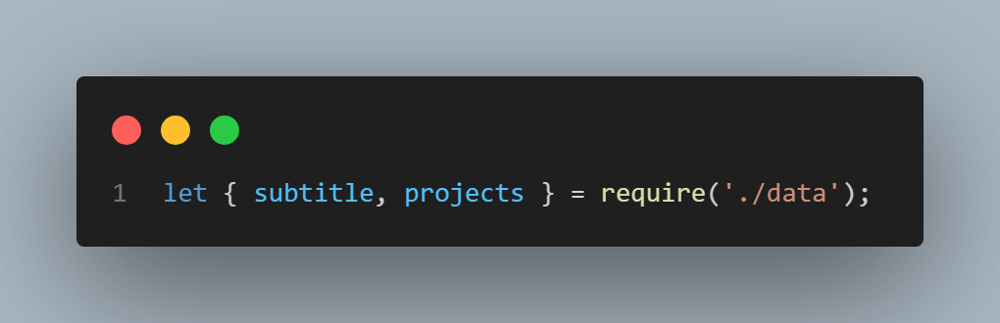

