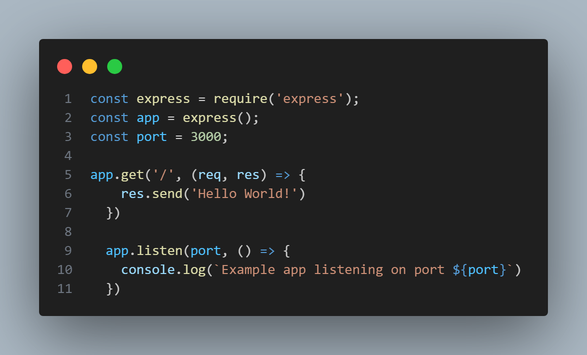
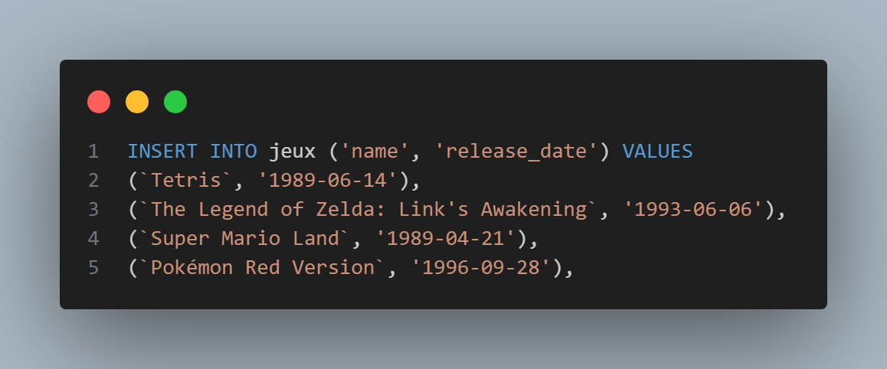
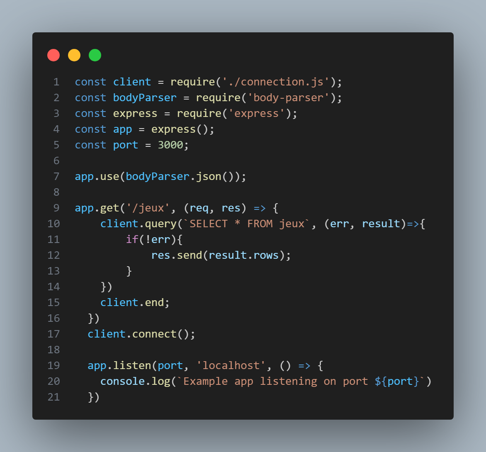
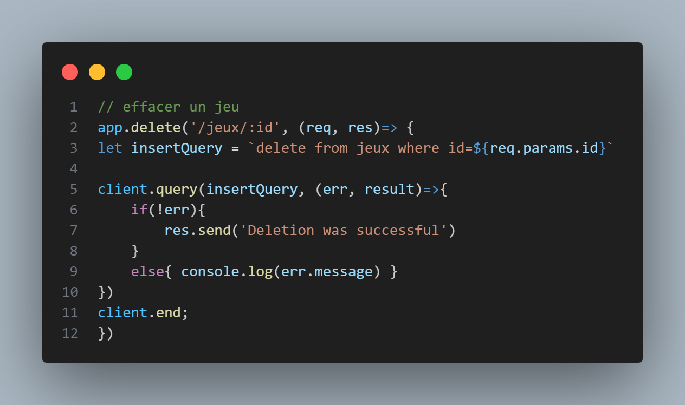

# coursNodeJs
# 04-API

## Installations

PS C:\Workspaces\coursNodeJs\04-API> **npm init -y**

PS C:\Workspaces\coursNodeJs\04-API> npm install nodemon express cors pg

création:  *__.gitignore__*

PS C:\Workspaces\coursNodeJs\04-API> **npm start**

Lancer l'extension Thunder
NewRequest

PS C:\Workspaces\coursNodeJs\04-API> **psql -U postgres -h localhost**

postgres=# **\l**

postgres=# **CREATE DATABASE my_first_api;**

postgres=# **\c my_first_api;**
Vous êtes maintenant connecté à la base de données « my_first_api » en tant qu'utilisateur « postgres ».

## Creation TABLE jeux

my_first_api=# CREATE TABLE jeux (
my_first_api(# id SERIAL PRIMARY KEY,
my_first_api(# name VARCHAR (50) NOT NULL,
my_first_api(# release_date DATE,   
my_first_api(# console_id INT DEFAULT 1
my_first_api(# );
CREATE TABLE

## Creation du fichier de données : addGame.sql

## Modification du fichier app pour le lier à body-parser

## Installation de body-parser pour afficher les données dans le fichier json

PS C:\Workspaces\coursNodeJs\04-API> **npm install body-parser;**

## Gestion de THUNDER REQUEST pour afficher la table, supprimer une ligne...

