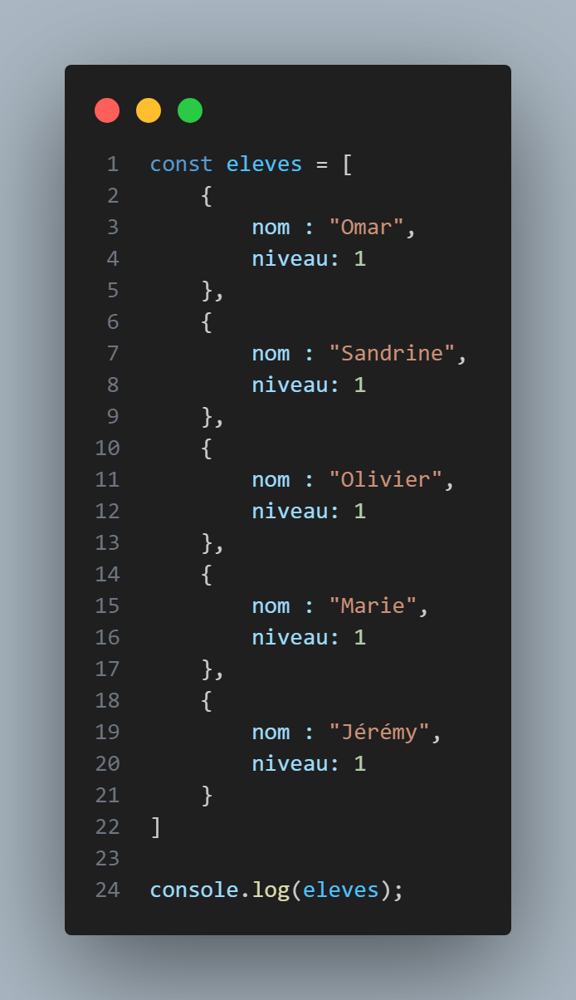
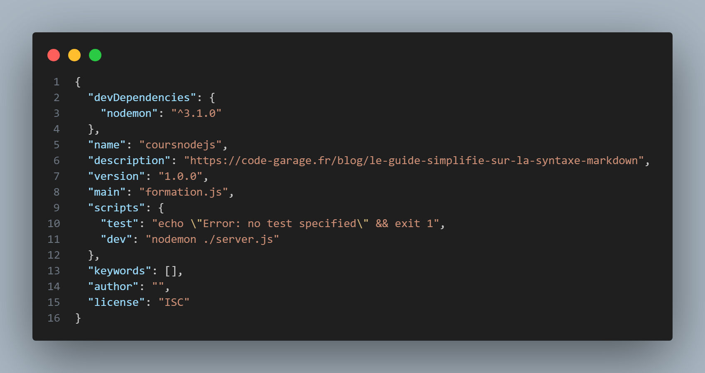

# NODE

## Rappels syntaxe : 
https://code-garage.fr/blog/le-guide-simplifie-sur-la-syntaxe-markdown

# Titre 1
## Titre 2
...
###### Titre 6

_italique_

**gras**

**_gras/italique_**

~~barré~~

## Cours / Exercices

Dans le Terminal GitBash

57522J@PWVD3139 MINGW64 /c/Workspaces/coursNodeJs
$ touch intro.js

57522J@PWVD3139 MINGW64 /c/Workspaces/coursNodeJs
$ node intro
hello
Bonjour je mappelle Sofiane
Bonjour je mappelle Thibault

57522J@PWVD3139 MINGW64 /c/Workspaces/coursNodeJs
$ node intro
hello
Bonjour je mappelle Sofiane
Bonjour je mappelle Thibault
Bonjour je mappelle Jeremy

### nouveau fichier : vehicule.js

57522J@PWVD3139 MINGW64 /c/Workspaces/coursNodeJs
$ touch vehicule.js

let voiture = {
    chevaux: 4,
    annee: 2024,
    energy: "diesel"
}

console.log(voiture);

console.log(voiture.energy);

console.log(voiture["energy"]);

#### Dans le terminal

57522J@PWVD3139 MINGW64 /c/Workspaces/coursNodeJs
$ node vehicule.js
{ chevaux: 4, annee: 2024, energy: 'diesel' }
diesel
diesel

let voiture = {
    chevaux: 4,
    annee: 2024,
    energy: "diesel",
    a: ()=> console.log(this),
    b: function () {
        console.log(this)
    }
}

voiture.a()
voiture.b()

#### Dans le terminal

57522J@PWVD3139 MINGW64 /c/Workspaces/coursNodeJs
$ node vehicule.js
{}
{
  chevaux: 4,
  annee: 2024,
  energy: 'diesel',
  a: [Function: a],
  b: [Function: b]
}

==> L'objet global de NODE est accessible de partout !!!!!!!

//============== LE DESTUCTURING ===============

let voiture = {
    chevaux: 4,
    annee: 2024,
    energy: "diesel",
    a: ()=> console.log(this, this.energy),
    b: function () {
        console.log(this, this.energy)
    }
}

#### Dans le terminal

PS C:\Workspaces\coursNodeJs> node vehicule
2024 diesel
PS C:\Workspaces\coursNodeJs> 

//========================
require('./formation');

#### Dans le terminal

57522J@PWVD3139 MINGW64 /c/Workspaces/coursNodeJs
$ node intro
[
  { nom: 'Omar', niveau: 1 },
  { nom: 'Sandrine', niveau: 1 },
  { nom: 'Olivier', niveau: 1 },
  { nom: 'Marie', niveau: 1 },
  { nom: 'Jérémy', niveau: 1 }
]
  Avec les modules :
  dans formation.js

dans intro.js

#### Dans le terminal

57522J@PWVD3139 MINGW64 /c/Workspaces/coursNodeJs
$ node intro
[
  { nom: 'Omar', niveau: 1 },
  { nom: 'Sandrine', niveau: 1 },
  { nom: 'Olivier', niveau: 1 },
  { nom: 'Marie', niveau: 1 },
  { nom: 'Jérémy', niveau: 1 }
]

### Avec le destructuring on peut exporter/ importer des élts d'un même module

Dans formation :

dans intro :

#### Dans le terminal
57522J@PWVD3139 MINGW64 /c/Workspaces/coursNodeJs
$ node intro
[ 'JavaScript', 'PostegreSQL', 'NodeJS' ]

Intro : Info System

#### Dans le terminal

57522J@PWVD3139 MINGW64 /c/Workspaces/coursNodeJs
$ node intro
{
  uid: -1,
  gid: -1,
  username: '57522J',
  homedir: 'C:\\Users\\57522J',
  shell: null
}

Infos syst 'fs'
'os' --> operating system
'fs' --> file system

//========= commande system 

const system = require('fs');
console.log(system);
throw new Error ('il y a une nouvelle erreur')

--> gestion d'erreurs avec throw, catch...

#### Dans le terminal

## Constitution d'un url

https://maif.fr/assurance

protocol : https://

domaine : 13.146.246.42

port : 3000

ressource : /assurance => end point (// avec API REST)

**_crypté (haché) ==> impossible à décrypter_**

PC --> requete --> Server

PC <-- response <-- Server ( response et requete avec head, body,... )

**! Rq :** Couper l'execution sur le Terminal : ctrl + c

const http = require('http');

const server = http.createServer(
    (Request, Response) => {
        console.log("Server created successfully");
    }
)

server.listen(8080, "localhost", ()=>{
    console.log("Server is listening on port 8080");
})

#### Dans le terminal

57522J@PWVD3139 MINGW64 /c/Workspaces/coursNodeJs
$ node intro
Server is listening on port 8080
 
==> Après avoir ouvert localhost:8080 dans le navigateur : 

#### Dans le terminal

 57522J@PWVD3139 MINGW64 /c/Workspaces/coursNodeJs
$ node intro
Server is listening on port 8080
Server created successfully

Pour obtenir la methode :

const http = require('http');

const server = http.createServer(
    (Request, Response) => {
        console.log("Server created successfully");
        console.log(Request.method);
    }
)

server.listen(8080, "localhost", ()=>{
    console.log("Server is listening on port 8080");
})

const http = require('http');

const server = http.createServer(
    (Request, Response) => {
        if (Request.url === '/formation') {
            console.log('Vous êtes en formation chez Simplon');
        } else if (Request.url === '/entreprise') {
            console.log('Vous êtes en alternance chez la Maif');
        }
    }
)

server.listen(8080, "localhost", ()=>{
    console.log("Server is listening on port 8080");
})

après avoir saisi : tttp://localhost:8080/entreprise dans le anv

57522J@PWVD3139 MINGW64 /c/Workspaces/coursNodeJs
$ node intro
Server is listening on port 8080
Vous êtes en alternance chez la Maif

Autre ex 

onst server = http.createServer(
    (Request, Response) => {
        if ((Request.url === '/' || Request.url === '/home') && Request.method === 'GET') {
            console.log('Vous êtes sur la page home');
        } else if ((Request.url === '/formation') && Request.method === 'GET') {
            console.log('Vous êtes sur la page Simplon');
        } else if ((Request.url === '/entreprise') && Request.method === 'GET') {
            console.log('Vous êtes en alternance chez la Maif');
        }
)

let rep = "";

const server = http.createServer(
    (Request, Response) => {
        if ((Request.url === '/profil') && Request.method === 'GET') {
            console.log('vous êtes sur la page profil');
            rep = true;
        } else if ((Request.url === '/contact') && Request.method === 'GET') {
            console.log('vous êtes sur la page contact');
            rep = true;
        } else if (rep !== true) {
            console.log('404 page non valide');
        }
        // } else {
        //     console.error('404 page non valide');
        // }
    }
)

server.listen(8080, "localhost", ()=>{
    console.log("Server is listening on port 8080");
})

// ===== Autre version avec Switch

switch (req.url) {
    case '/':
    case '/home':
       console.log('Vous êtes sur la home page');            
        break;
    case '/formation':
       console.log('Vous êtes en formation chez Simplon');
        break;
    case '/entreprise':
       console.log('Vous êtes à la Maif');
        break;
    case '/maison':
       console.log('Vous êtes en pyjama');
        break;
    default:
       console.log('404 dans les choux');
        break;
}

const server = http.createServer(
    (Request, Response) => {

        Response.setHeader("content-type", "text/html");
        Response.write('<head><meta charset="UTF-8"></head>')

        if ((Request.url === '/' || Request.url === '/home') && Request.method === 'GET') {
            Response.write('<h1>Vous êtes sur la page home</h1>');
        } else if ((Request.url === '/formation') && Request.method === 'GET') {
            Response.write('<h1>Vous êtes sur la page Simplon</h1>');
        } else if ((Request.url === '/profil') && Request.method === 'GET') {
            Response.write('<h1>vous êtes sur la page profil</h1>');
            // rep = true;
        } else if ((Request.url === '/contact') && Request.method === 'GET') {
            Response.write('<h1>vous êtes sur la page contact</h1>');
            // rep = true;
        // } else if (rep !== true) {
        //     Response.write('404 page non valide');
        // }
        } else {
            Response.write('404 page non valide');
        }
        Response.end()
    }
)

# Installation nodemon

permet de relance le code à chaque modif

PS C:\Workspaces\coursNodeJs> npm install --save-dev nodemon

PS C:\Workspaces\coursNodeJs> npm init -y

==> création d'un dossier node_modules (à ne pas modifier !!!!)

==> création de 2 fichiers json

dans script, inidiquer les fichiers à relancer automatiquement à chaque modif :
  "dev": "nodemon ./server.js"

  

ex : "start": "nodemon index.js" <== lancement de index.js

